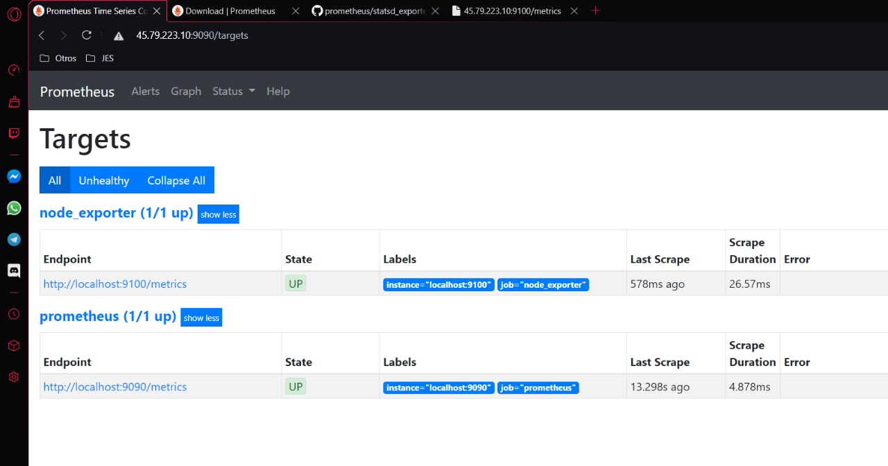
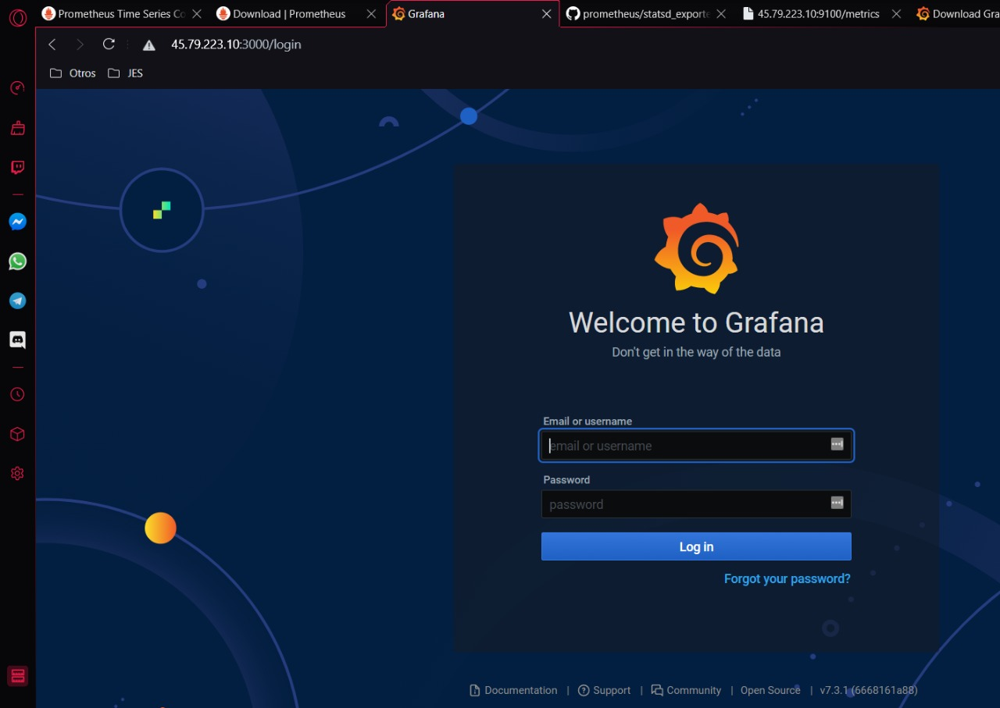
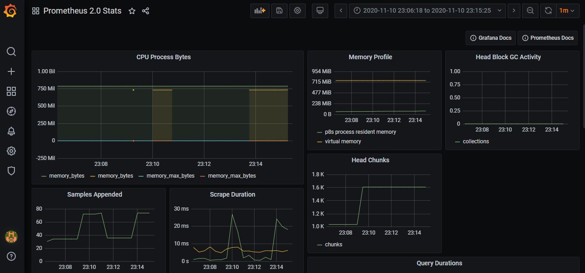

# proyecto_grupo16_so2

## Monitoreo 

Para la parte de monitoreo se utilizaron modulos del kernel para obtener información del CPU y de la 
memoria, también se instalaron promethus y grafana para visualizar de forma gráfica el comportamiento
de la máquina en cuanto a rendimiento de estos recursos de la máquina, para mayor información lea este
[archivo](Monitoreo/README.md)

# Instalación de Promethus 

```bash
# obtener el archivo zip
wget https://github.com/prometheus/prometheus/releases/download/v2.22.1/prometheus-2.22.1.linux-amd64.tar.gz

# descomprimir el archivo
tar -xzf prom...

# Ingresar a la carpeta
cd prom...

# correr el archivo de instalación
./prometheus

# Ingresar al navegador y visualizar instalado prometheus
go localhost:9090/graph

#Instalar modulo para lectura de procesos y memoria
NODE EXPORTER

wget https://github.com/prometheus/node_exporter/releases/download/v1.0.1/node_exporter-1.0.1.linux-amd64.tar.gz

tar -xzf node...
```



# Instalación Grafana


```bash
# Descargar y obtener grafana
wget https://dl.grafana.com/oss/release/grafana-7.3.1.linux-amd64.tar.gz

# Descomprimir el archivo 
tar -zxvf grafana-7.3.1.linux-amd64.tar.gz
```







Configuracion del Tablero en Grafana


## Kubernetes

Para la demostración de kubernetes y contenedores se utilizo una aplicación que muestra una serie de
reportes sobre el covide 19, cabe resaltar que estos datos no son reales se utilizo una back-end 
elaborado en nodejs, express y babel para mayor info lea [aquí](/backend/README.md), para la 
aplicación de front-end se utilizó react se explica mayor info [aquí](frontend/README.md), y una conexión a una base de datos de MongoDB.
